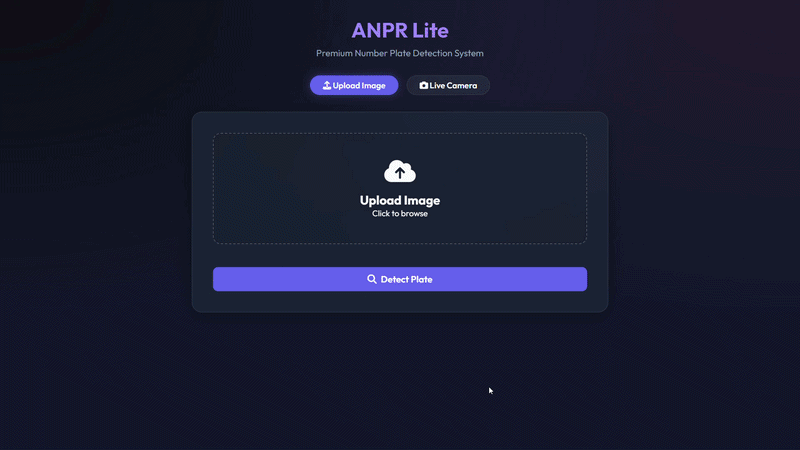
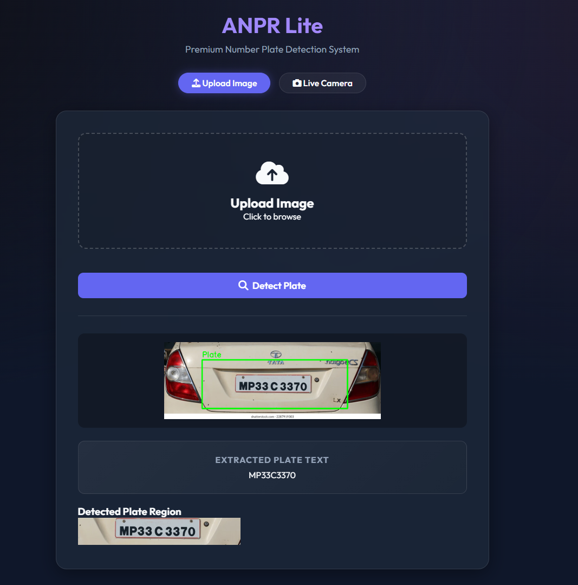
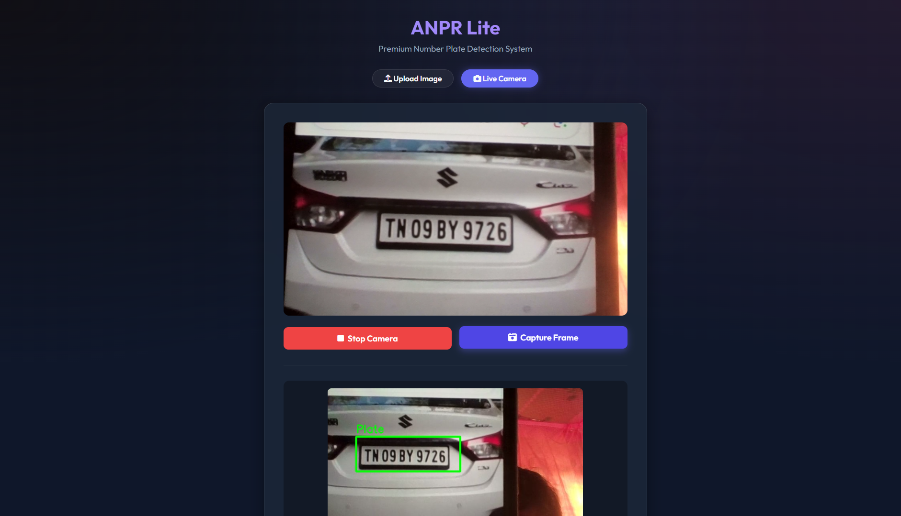
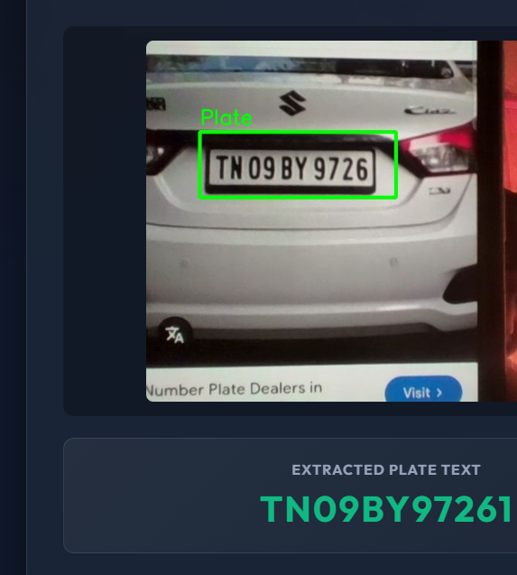

# Number Plate Detection System (ANPR Lite)

Welcome to **ANPR Lite**, a premium, production-ready Automatic Number Plate Recognition (ANPR) web application. This platform offers seamless vehicle number plate detection combined with Optical Character Recognition (OCR), wrapped in a sleek, scalable Glassmorphism UI.

---

## 🖼️ Project Demo

### 📌 Animated Demo


---

### 📌 Image Upload Detection


---

### 📌 Live Camera Detection


---

### 📌 Detection Result & OCR Output


---

## 🎯 Features

- **Image Upload:** Upload vehicle images and detect number plates instantly.
- **Live Webcam:** Real-time detection using camera input.
- **Plate Detection:** OpenCV Haar Cascade based detection.
- **OCR Recognition:** Extracts plate text using EasyOCR/Tesseract.
- **Plate Region Extraction:** Crops detected plate for better accuracy.
- **Modern UI:** Clean glassmorphism-based responsive design.
- **Error Handling:** Robust fallback system for OCR and detection failures.

---

## 📁 Folder Structure

```
Car_Number_Plate_Detection/
│
├── app.py                       # Main Flask backend application core
├── requirements.txt             # Python dependency libraries list
├── README.md                    # Project documentation
│
├── models/
│   └── haarcascade_russian_plate_number.xml   # Haar Cascade plate detector model
│
├── src/
│   └── detector.py              # OpenCV detection and OCR helper logic
│
├── static/
│   ├── styles.css               # Glassmorphism UI styling
│   ├── screenshots/             # Demo screenshots shown in README
│   ├── uploads/                 # Raw user uploaded images
│   └── outputs/                 # Images with detection overlays
│
└── templates/
    ├── index.html               # Homepage and upload interface
    └── camera.html              # Webcam detection UI
```

## 🚀 Installation & Setup

### 1. Prerequisites
Ensure you have Python 3.8+ installed on your system.

### 2. Install Tesseract OCR (Crucial for Text Extraction)
* **Windows:**
  - Download the [Tesseract installer for Windows](https://github.com/UB-Mannheim/tesseract/wiki).
  - Install it (usually to `C:\Program Files\Tesseract-OCR\`).
  - *Note:* Our system checks this default Windows path automatically, meaning no environment variables tweaking is technically necessary for a standard install!
* **Linux (Ubuntu/Debian):**
  - Run `sudo apt install tesseract-ocr`

### 3. Setup Python Virtual Environment (Optional but Recommended)
```bash
# Navigate to the project directory
cd number_plate_web_app

# Create a virtual environment
python -m venv venv

# Activate it (Windows)
venv\Scripts\activate
# Activate it (Mac/Linux)
source venv/bin/activate
```

### 4. Install Dependencies
```bash
pip install -r requirements.txt
```

### 5. Run the Application
Start the Flask development server:
```bash
python app.py
```
Then, open your web browser and navigate to: `http://127.0.0.1:5000/`

## 🧪 Error Handling
- **Missing OpenCV Models:** The system downloads `haarcascade_russian_plate_number.xml` upon initialization automatically.
- **Tesseract Absent:** If Tesseract isn't installed locally, the backend catches the error and issues a UI warning instead of crashing.
- **Camera Permissions:** The browser handles hardware natively natively providing an alert if blocked.

## 📄 License
This project is open-source and free to be adapted for educational or enterprise applications.

---
*Built with ❤️ utilizing Python, OpenCV and Flask.*
